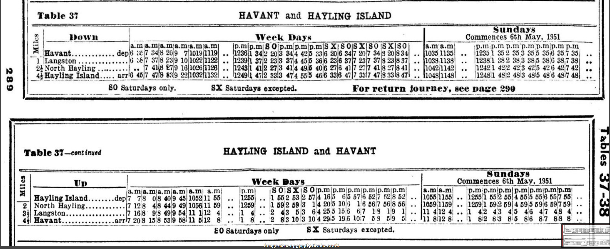

# Some thoughts on old timetables

## General

Wouldn't it be great to be able to go back in time and see what journeys could be planned using a timetable from 50-60-70-100 years ago? Surely the technology to do that must be nearly there?

This is a collection of notes regarding what I've found so far.

In my day job I've been working a lot recently with the open data feed for the [GB rail timetable](https://datafeeds.networkrail.co.uk/), in both JSON & CIF format. I've also recently been catching up on my (real, paper) reading, including some past issues of [The Southern Way](http://www.crecy.co.uk/the-southern-way).

It struck me that it would be interesting to try to construct an electronic version of an old SR timetable, and then do journey planning on it to be able to compare "then & now". (Think Ryde-Freshwater, or the *Atlantic Coast Express* from Waterloo to Padstow.)

So, as you do, I started breaking the task down in my head into the various steps necessary:

1. Get old timetable (well that's easy, I've got Southern Region ones from 1949, 1953 & 1960)
2. Scan old timetable (not so easy)
3. OCR the scan into, say a CSV or Excel (probably going to be the hardest step)
4. Write a script to turn that into CIF/JSON
5. Play with it

Well, that's how my thinking started, then I realised how badly most tables would scan, and that I'd probably end up typing it all in by hand. Well, that would mean really sticking to just one line or table - no way I'd ever have enough time to do more than one (simple) table, let alone a whole book.

At this point I discovered [GTFS](http://gtfs.org/) - I'd never needed to know anything about it before, since my day job isn't about journey planning, it's about matching train passes to the timetable after the event. A GTFS timetable should in theory be easier to create from a CSV/Excel file. So maybe that's step (4) made a little easier. Still, the notes in text at 90 degrees (e.g. information about restaurant cars, train names, etc) would probably confuse things.

There's also the not insignificant issue that, in older timetables, it's not immediately obvious whether the time against a station is a stop on this service or a connection from this service. It would usually have required local knowledge or asking the guard. (These days, the accepted practice is to put connections in *italic type*.) Examples of the problem can be found in the [Alton-Southampton Table 71](https://timetableworld.com/book_viewer.php?id=6&section_id=1786):


Here, the Alton-Droxford-Fareham stations are inset, so the assumption is that that's not a through train from Waterloo (and the Fareham-Gosport service is a further connection). However, the Alton-Winchester-Southampton service isn't indented, so one could be forgiven for thinking it's a through service from Waterloo. In fact, it was a shuttle service between Alton & Southampton (Terminus) - probably one of the factors that contributed to the line's demise. It's also only by careful inspection that you spot that the train doesn't go to Southampton Central - that's a connection too (note G is "Southampton Terminus (for Docks)"). The worst case for this is what, on the face of things, looks like the 2.27pm (Weekdays) Waterloo-Alton-Southampton Terminus-Southampton Central train (arr 5.27pm) - in fact, it's the 2.27pm Waterloo-Alton (arr 3.47pm - [Table 76](https://timetableworld.com/book_viewer.php?id=6&section_id=1791)), then the 4.10pm Alton-Southampton Terminus (arr 5.24pm) train as far as Eastleigh (arr 5.05pm), changing there onto the 3.30pm Waterloo-Bournemouth train [Table 45](https://timetableworld.com/book_viewer.php?id=6&section_id=1760). This leaves Eastleigh at 5.16pm and gets to Southampton 5.27pm. Nowhere is it made clear that you need to change at Eastleigh - you only get that by inspecting the other tables. I wonder how many people realised it wasn't a through train - but then changed at Northam instead? Oh, and note that I've not been specific about where the Bournemouth train ended up. It got to Bournemouth Central at 6.26pm - but did it then continue on to Bournemouth West (arr 6.40pm), or was that a very tight 4 minute connection?

I then tried to get my head around the scanning problem - step (2). On a sudden whim I googled old railway timetables - and ended up finding [Timetable World](https://timetableworld.com/)! Here is a huge collection of historical timetables, all scanned and indexed. Thank you very much to Matthew Shaw for the time and dedication he's into that site so far, and to all the contributors.

So, I picked a timetable, the [SR timetable for September 1950](https://timetableworld.com/book_viewer.php?id=6) and, for a starting point, everyone's favourite south coast holiday line, [Table 37: Havant to Hayling Island](https://timetableworld.com/image_viewer.php?id=6&section_id=1752).

In theory, surely it should be no more difficult than the transcription already carried out by armies of volunteers for family history research purposes?

Like many large images (e.g. maps, archive documents), the scans on Matthew Shaw's website are all tiled images cleverly stitched together. So it's not just a case of downloading an image and OCRing it. However, as a first test, I used Windows' Snipping Tool to grab a screenshot:



Next, just to see what would happen, I pointed [tesseract](https://sourceforge.net/projects/tesseract-ocr-alt/files/tesseract-ocr-setup-3.02.02.exe/download) at it.

Unfortunately, I got a rather uninspiring result:

```
Table 37 HAVANT and HAYLING ISLAND
| ts: — -— . = —-
I m ; I Sun_days
3 l Down ' , ,, ,, \_Ye_e_l;_l)n_yjs Cozgncncgcs hm M:,w._‘1951____
l  ‘ ,a.m_n.m gm |.zn*u.m‘un lam p.ml3 0*p.m'p.m|y.m S X S 0 8 X! 30 :3 X 80 3.111 n.m {pan p.m v.m‘n.m‘p.m§p.m p.m
__ _:Ea.v;nc , , _ , _ _. , de 5 7 348 20,9 7\1Dl9 I119 .. 1235 1 S42 ‘4)!3 344 4215 3.16 an 347 ‘(DJ 34 @884 .. 10351135 .. 12351 352 35 3 355 354? 35,7 35. .
1 1 Langston”, Lb 37823810102211 .. 12391372 2313 371445 36 B 37 93737323837 .. 10351138’ .. l23S\3823S338538‘G38‘738 n
n I 2§North Hlyling . .. 7 4] 279 1610261125 .. 12 1412918 41% 495 40627 4]7L'71418278-11 .. 104TIll42 .. ;1!14‘.‘.1 4 ‘£3 :5 426 ..
a ‘J; ‘ yljx_x_g_Is1a _¢p_7 47 inc}; 2-210 1132 .. 124914-.2 33g_4jg 555 as as 4'. I 331 47333 47 .. 1o4s|11_-ss .. 134351 " gm} ’..
I9 I_ _ _ > _ _Sn.c}n-day: only. 7* _sx Safgrdnyn excepted. I-‘ox-J-Vg_tu___|‘|_]ou1{ney._9§9_]ga;g:
. 
Q
Table s'l—mmm HAYLING ISLAND and EAVANT n
In
‘a " i 3: Sundays
_ up week .3)’; commences 63!: Mag._1951
if a.myg,mm,m 3,3) mm: a.m: 5 018! S O p.mrp_m,'p.mlp.m 9.m p.m A.mlA.m ‘p.m‘p.m{p.m p.m§n.m‘p.m!v.|n.
__ nnylhu 1sland.. .dep7 73 013 409 45 105231 on . 1 662 53 2 574 16:5 sgq 57:5 52. 529 52 .. 1055:1155 .. 12551 552 55 4 555 as-is 5517 an: I
2 Norm Hayling. .. 1 ms 455 449 49‘ 105411 59; . 1 W2 59 s 1 4 ms 10-: Is 567 5618 66» .. 1oo9;un9 .. 12591 59.2 5914 5355916 59:7 59‘
3 Lnngston ,_ 7163 91S499b4‘111|12 4,‘ . 2 4:3 53 64255116 0,7 19 19 1 1141124: ‘,1 42 43 45 46 4'1 4‘B on
—(3‘flivgn_t:, .1-/_2o§> ;§‘s_5:} 9__|5_e1_:p_g;gA 3‘ _,. V'__..._2_g3 10 3 10 4A2_9«5i9:tLlq57 5 S 549%.’: __., }VI_7§s12 L: 11 82 as s_5_A§6#§7 B-S 
so Sgfiufdgyg gm, 5! Saturdays ucepced. —,
```

Hmmm. At this point, it would seem we are back to typing it all in by hand...

Incidentally, there are a couple of good threads on the issues relating to timetable scanning generally on Rail UK Forums: [Timetable demo for timetableworld.com](https://www.railforums.co.uk/threads/timetable-demo-for-timetableworld-com.204918/) and [timetableworld.com](https://www.railforums.co.uk/threads/timetableworld-com.204425/).

## Manual transcription

As a next attempt, I therefore went for manual typing in the complete timetable. The first columns (Down service, weekdays) look like this:

|Table 37|HAVANT and HAYLING ISLAND||Weekdays||||| |    |   |   |   |   |   |   |   |   |   |   |   |
|---:|:---|---:|---:|---:|---:|---:|---:|---:|---:|---:|---:|---:|---:|---:|---:|---:|---:|---:|---:|---:|
|Miles|Down          |   | am| am| am| am|  am|  am|  pm| pm| SO| pm| pm| pm| SX| SO| SX| SO| SX| SO|
|    0|Havant        |dep|635|734|820|907|1019|1119|1236|134|220|334|442|533|620|634|720|734|820|834|
|    1|Langston      |   |638|737|823|910|1022|1122|1239|137|223|337|445|536|623|637|723|737|823|837|
|  2.5|North Hayling |   |   |741|827|916|1026|1126|1243|141|227|341|449|540|627|641|727|741|827|841|
|  4.5|Hayling Island|arr|645|747|833|922|1032|1132|1249|147|233|347|455|546|633|647|733|747|833|847|

Note that, for ease of typing, I've turned vulgar fractions into decimals in the *Miles* column, but left the times in 12-hour format. I've inserted leading zeroes in the minutes values where necessary, but not in the hours - again, to be as close to the original yet still easily be typable/interpretable.

The complete timetable thus transcribed can be viewed in [csv format](docs/Table_37_Havant_and_Hayling_Island_orig.csv) or [Excel xlsx format](Table_37_Havant_and_Hayling_Island_orig.xlsx).

## Conversion to script-readable format

The next stage is to turn this into something potentially more readable by a script. In the future, the aim might be to transcribe directly to a script-readable format?

To do this, I've split the four sections (Down Weekdays/Down Sundays/Up Weekdays/Up Sundays) across four [Excel sheets](docs/Table_37_Havant_and_Hayling_Island_split.xlsx). I've also saved them as individual csv sheets:

- [Down Weekdays](docs/Table_37_Havant_and_Hayling_Island_split_DW.csv)
- [Down Sundays](docs/Table_37_Havant_and_Hayling_Island_split_DS.csv)
- [Up Weekdays](docs/Table_37_Havant_and_Hayling_Island_split_UW.csv)
- [Up Sundays](docs/Table_37_Havant_and_Hayling_Island_split_US.csv)

## Conversion to GTFS

The next stage would be to see how we can get this into something that GTFS would recognise.

The [GTFS General Transit Feed Specification Reference for static feeds is here](http://gtfs.org/reference/static). (In future, we might want to play with a "real-time" type feed, allowing someone to playback what might have gone past a location in days gone by - though that would ideally also require freight trains, so we'd need to use working timetable to generate it!)

The GTFS is basically zip file containing csv files. Some of these are mandatory, others optional. Here are the ones we'll definitely need for the Hayling Island service (we could also use shapes.txt if we wanted to be able to plot the journey on a map, but it's not required).

Incidentally, [Planar Network](https://planar.network/projects/feeds) has a link to the [RDG's current GB rail timetable in GTFS format](https://s3.eu-west-2.amazonaws.com/feeds.planar.network/gb-rail-latest.zip), which can be used to check some of the decisions we make in this project.

Another reference point is [Linus Norton's CIF to GTFS project](https://ljn.io/posts/CIF-to-GTFS).

### agency.txt

This is a file with just one data row, defining who's running this set of services. It's a little irrelevant for something that happened 70 years ago, but it's mandatory, so we'll just have to make something up. We'll only use the absolutely necessary fields.

```
agency_name,agency_url,agency_timezone
British Railways Southern Region,https://github.com/davejbur/pasttimes,Europe/London
```

### stops.txt

This is a list of all the stations in the timetable (as a whole). Thus, in future, we'd add in other stops for other services. One of the required fields is the lat/long of the station. This is provided in the RDG's feed referred to above, so we can borrow it for Havant, which is still open:

```
stop_id,stop_code,stop_name,stop_desc,stop_lat,stop_lon,zone_id,stop_url,location_type,parent_station,stop_timezone,wheelchair_boarding
HAV,HAVANT,Havant,2,50.85443,-0.98161,,,,,Europe/London,0
```

In this dataset, the stop_id appears to be the CRS for the station, the stop_code is the TIPLOC (which we'll need if/when we come to do a CIF/JSON version). I can't decide how stop_desc is used here - it seems to have a value of 0, 1, 2, 3, or 9. The lat/long is here, the next four columns are all blank, the timezone is London (or Dublin for stations in RoI), and wheelchair_boarding is always 0. For our purposes therefore we'll just take the first three columns and the lat/long.

The other three stations are long gone, so we'll just have to estimate them from a map. We'll also have to create TIPLOCs for them, obviously ones that aren't already in use. (These will also be useful if we create a CIF/JSON version of the timetable.)

One good way of obtaining lat/longs for closed station is via that fount of all Internet knowledge, Wikipedia. For instance, [Langston Railway Station](https://en.wikipedia.org/wiki/Langston_railway_station) was at OS Grid Reference [SU716049](https://tools.wmflabs.org/geohack/geohack.php?language=en&params=50.83920786923;-0.9845132583844_region:GB_scale:25000&pagename=Langston_railway_station). Following the latter link gives us a decimal lat/long of 50.839208, -0.984513.

For possible future reference, the XPath in the wiki article for the grid ref is:
```
/html/body/div[3]/div[3]/div[4]/div/table[1]/tbody/tr[6]/td/span/a
```

...whilst that in the wmflabs article for the geo data is:
```
/html/body/div[2]/div[1]/div/div[1]/div/div[1]/table/tbody/tr[1]/td[1]/span[3]
```
The complete stops.txt file for this project is therefore:

```
stop_id,stop_code,stop_name,stop_lat,stop_lon,location_type
HAV,HAVANT,Havant,50.85443,-0.98161,1
LNS,LANGSTN,Langston,50.839208,-0.984513,1
NHA,NHAYLNG,North Hayling,50.820314,-0.983503,1
HYI,HAYLNGI,Hayling Island,50.793439,-0.995437,1
```

#### Additional information

By the way, there is also the [Department for Transport's GTFS dataset](http://naptan.app.dft.gov.uk/datarequest/GTFS.ashx). Note that it apparently doesn't conform to GTFS, since it is actually tab-separated - I'm sure there is a reason for this. Note also that the stop_id appears to be "9100<TIPLOC>", not the CRS, whilst the stop_code is blank!

```
stop_id	stop_code	stop_name	stop_lat	stop_lon	stop_url	vehicle_type
9100HAVANT		Havant, Havant Rail Station	50.85443	-0.98161	NULL	2
```

The "vehicle_type" column appears to refer to the types of vehicle that use the stop, and can take one of the following values:

|Value|Apparent meaning|
|---|---|
|1|Underground, metro, tram or heritage railway|
|2|Mainline train|
|3|Bus|
|4|Boat or ship|
|21|Taxi|
|22|Aircraft|
|(blank)|Generic, or more than one of the above!|

### routes.txt

This file defines a route, using one or more stops. With a simple branch line, it's easy. Well, nearly. The [GTFS Best Practice](http://gtfs.org/best-practices/#routestxt) says that "Different directions of a route should not be separated into different route_id values." However, inspection of the RDG dataset shows exactly that happening. For instance, Island Line has the following routes defined:

```
route_id,agency_id,route_short_name,route_long_name,route_type,route_text_color,route_color,route_url,route_desc
8756,IL,IL:RYP->SHN,IL train service from RYP to SHN,2,,,,Train. Standard class only. Reservation not possible
8758,IL,IL:RYR->SHN,IL train service from RYR to SHN,2,,,,Train. Standard class only. Reservation not possible
8782,IL,IL:RYP->RYR,IL train service from RYP to RYR,2,,,,Train. Standard class only. Reservation not possible
8786,IL,IL:RYR->RYP,IL train service from RYR to RYP,2,,,,Train. Standard class only. Reservation not possible
8787,IL,IL:SHN->RYP,IL train service from SHN to RYP,2,,,,Train. Standard class only. Reservation not possible
36450,IL,IL:SHN->RYR,IL train service from SHN to RYR,2,,,,Train. Standard class only. Reservation not possible
```

The route_id appears to be an incremental value (rather than having any inherent meaning), though the file itself is randomly ordered. The routes themselves appear effectively to be a list of all pairs of origins & destinations. The choice here then is one of :

- stick to the spec and call it the "Havant and Hayling Island" route, regardless of direction of travel.
- follow RDG practice and have a route defined for each possibility (more complicated at this stage but might be clearer in the long run)

For the time being, I've decided to go for the latter, but I might review that. I've used the table number as an ID, with suffixes for possible routes. For more complicated tables, this might not suffice. What about trains that are shown across multiple tables?

```
route_id,route_long_name,route_type
37D,Havant to Hayling Island,2
37U,Hayling Island to Havant,2
```

### calendar.txt

Here we get to specify the dates of operation. We make up an ID, provide the start & end dates for that ID, and then which days it operates between those dates. In this case, the timetable started on (Monday) 25th September 1950, so that's easy. However, it runs "until further notice" - presumably until the following May/June? (The [LM timetable 1962/3](https://timetableworld.com/book_viewer.php?id=2&section_id=-1) ran from (Monday) 10th September to (Sunday) 16th June.) Certainly the timetable refers to the Sunday service starting on 6th May 1951. So let's go for an end date of (Sunday) 17th June for the sake of argument - noting however that GTFS apparently struggles with a span of more than three months.

This covers all possibilities for the Hayling Island service. However, additional entries will arise when it comes to other services that start/end on different dates in the season, or operate (or don't) on other days of the week.
```
service_id,sunday,monday,tuesday,wednesday,thursday,friday,saturday,start_date,end_date
WDS,0,1,1,1,1,1,1,19500925,19510617
SX,0,1,1,1,1,1,0,19500925,19510617
SO,0,0,0,0,0,0,1,19500925,19510617
SUN,1,0,0,0,0,0,0,19510506,19510617
```

### calendar_dates.txt

This file is empty at present as there are no odd dates for the Hayling Island service.

### trips.txt

This one appears to be simply a list of the trips run on this route - effectively an entry for each column in the timetable (at least for the Hayling Island line). I've used the column number as the ID - although they aren't actually given in this table!

```
route_id,service_id,trip_id
37D,WDS,1
37D,WDS,2
37D,WDS,3
37D,WDS,4
37D,WDS,5
37D,WDS,6
37D,WDS,7
37D,WDS,8
37D,SO,9
37D,WDS,10
37D,WDS,11
37D,WDS,12
37D,SX,13
37D,SO,14
37D,SX,15
37D,SO,16
37D,SX,17
37D,SO,18
37D,SUN,19
37D,SUN,20
37D,SUN,21
37D,SUN,22
37D,SUN,23
37D,SUN,24
37D,SUN,25
37D,SUN,26
37D,SUN,27
37U,WDS,1
37U,WDS,2
37U,WDS,3
37U,WDS,4
37U,WDS,5
37U,WDS,6
37U,WDS,7
37U,SO,8
37U,SX,9
37U,SO,10
37U,WDS,11
37U,WDS,12
37U,WDS,13
37U,WDS,14
37U,WDS,15
37U,WDS,16
37U,SUN,17
37U,SUN,18
37U,SUN,19
37U,SUN,20
37U,SUN,21
37U,SUN,22
37U,SUN,23
37U,SUN,24
37U,SUN,25
```

### stop_times.txt

This is the big one! We need to turn the entire transcribed table into a set of services. This is the part that most lends itself to some sort of automation.

```
trip_id,arrival_time,departure_time,stop_id,stop_sequence
```

## Summary of issues found so far

1. Digitising the original printed timetable is difficult
    1. OCR is rarely clever enough, since, as shawmat points out in the thread mentioned above, every digit has to be checked manually. (We can't even make it cleverer by adding rules regarding what values to accept, since a time in one row might actually be before the time in the row above, e.g. for connections)
    2. Manual typing would require a *huge* amount of effort. It's the sort of thing family history societies do for old documents. Typically two or more transcriptions are provided for each record, from different people, and the results compared.
2. Many old stations no longer exist. These will need to be "(re)created" for a CIF/GTFS file - the CIF file would need a unique TIPLOC for each station, the GTFS would need the lat/long co-ordinates for each one.
3. Old timetables have a number of differences to timetables these days. Well, they were printed for a start, and read:-)
    1. Times in 12 hour format not 24 hour. Not a huge problem, since we should be able to get it right most of the time - though sometimes the "a.m."/"p.m." heading gets replaced by "SO"/"SX", so we'd need to check the columns either side.
    2. Connection times shown in same font as the main/through trains - so there needs to be some guessing as to which it is. Often it's obvious - but not always.
    3. Lots of vertical text for e.g. train names or other notes.
4. There are other issues that would still apply with timetables today.
    1. Following on from the point regarding connections, there would need to be a decision on how to deal with trains shown in more than one table, and how to process them without duplication into a CIF/GTFS version.
    2. There are still many notes, which would need processing if appropriate. Obviously, it depends on how detailed we want to make the end result. Would we want to include details such as "conveys restaurant car between London and Somewhere on Mondays, Wednesdays and Thursdays between 8th June and 31st July"? or just keep it simple for the time being?

